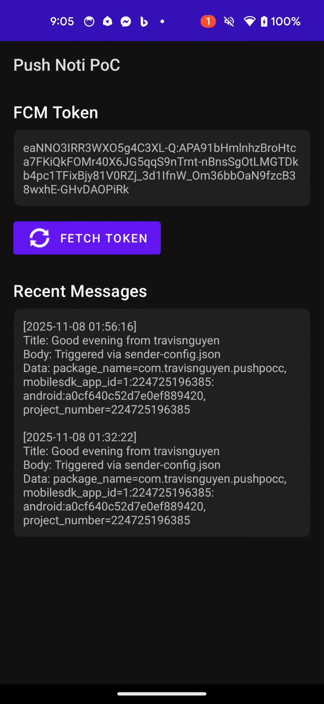

# Android Push Notification PoC

Minimal Firebase Cloud Messaging (FCM) proof-of-concept that:

- Requests Android 13+ notification permission at runtime.
- Retrieves, logs, and displays the current FCM registration token.
- Handles notification + data payloads in the foreground/background via `FirebaseMessagingService`.
- Stores the most recent token/messages locally so you can see them in-app.
- Ships with a Python sender that calls the HTTP v1 API using a service-account JSON.
- 


## Prerequisites

- Android Studio Giraffe or newer on macOS (JDK 17 included).
- Firebase project with Cloud Messaging enabled.
- Service account with the **Firebase Admin SDK Administrator** role (download the JSON).
- Python 3.11+ available on macOS for the sender script.

## Android project setup

1. In the Firebase console create an Android app that uses the package `com.example.pushpoc` (or update `applicationId`/`namespace` if you prefer another id).
2. Download the generated `google-services.json` and drop it at `app/google-services.json` (replace the existing placeholder file).
3. In Android Studio: *File → Open...* and select this folder. Let Gradle sync the project.
4. Run the app on a Google Pixel (Android 13+) or emulator. Accept the notification permission prompt.
5. Open **Logcat** and filter by `FCM token:` to copy the registration token if you need it elsewhere.

## What to expect in the app

- **Fetch Token** button: forces a token refresh and updates the on-screen text.
- **Recent Messages**: shows the latest payloads captured by `MessageStore` (foreground/background/data-only).
- Push notifications trigger system toasts + status-bar notifications while also caching the payload for review.

## Sending test pushes from macOS

Install the tiny Python tool dependencies once:

```bash
python3 -m venv .venv
source .venv/bin/activate
pip install -r tools/sender/requirements.txt
```

Configure once, then run:

1. Copy the template config and fill in your details:
   ```bash
   cp tools/sender/sender-config.json.example tools/sender/sender-config.json
   # edit the file to point at your service-account.json, project id, and device token
   ```
2. With the config in place you can simply run:
   ```bash
   python tools/sender/send_fcm.py
   ```
   Command-line flags still override anything in the config, e.g.:
   ```bash
   python tools/sender/send_fcm.py --title "Hello" --data foo=bar
   ```

Tips:

- Omit title/body (in the config or CLI) to test **data-only** messages. The service will still show an in-app toast + notification built from the data payload.
- Use the same service account for all tests; the script automatically mints an OAuth token scoped for FCM.
- If the request fails, check that the `project_id` matches the Firebase project that issued `google-services.json`.

## Repository layout

```
app/                    # Android module (Kotlin, Gradle KTS)
├── google-services.json.placeholder
├── src/main/java/com/example/pushpoc
│   ├── MainActivity.kt
│   ├── data/MessageStore.kt
│   └── messaging/PushMessagingService.kt
└── src/main/res/...    # Layouts, themes, drawables

tools/sender/           # Python FCM HTTP v1 helper
```

## Next steps

- Wire the app id + SHA-256 cert fingerprint into Firebase so messaging works on your devices.
- Optionally swap the package name + application id, but keep the sender script token consistent.
- Commit your real `google-services.json` privately (or keep it untracked) depending on your security posture.


